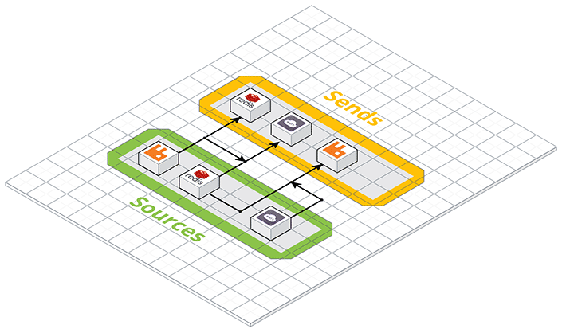

.. nanopipe documentation master file, created by
   sphinx-quickstart on Sun Oct 16 11:50:57 2016.
   You can adapt this file completely to your liking, but it should at least
   contain the root `toctree` directive.

Welcome to Nanopipe documentation
===============================================================================

Nanopipe is a library that allows you to connect different message queue
systems (but not limited to) together. Nanopipe was built to avoid the 
glue code between different types of communication protocols/channels that
is very common nowadays. An example of this is: you have an application that
is listening for messages on an AMQP broker (ie. RabbitMQ) but you also
have a Redis pub/sub source of messages and also a MQTT source from
a weird IoT device you may have. Using Nanopipe, you can connect both MQTT
and Redis to RabbitMQ without doing any glue code for that. You can also
build any kind of complex connection scheme using Nanopipe. For more information,
take a look at the :ref:`architecture`.

Visit the `Nanopipe Github repository <https://github.com/perone/nanopipe>`_
for sources, issues, etc. If you want to contribute, take a look at our
:ref:`contributing` guideline.

Nanopipe features
-------------------------------------------------------------------------------

- Open-source (Apache License)
- Written in modern C++
- Valgrind clean
- Declarative definition of the connection graph
- Uses well established event loops (libuv, etc)
- Scalable (sources/sends are threaded)
- Simple producer/consumer queues between source/sends, with very low
  synchronization overhead
- Multiple source/sends share the same message memory
- Supports AMQP, MQTT, Redis, C++ Streams, (more to come: WebSockets, REST, etc)
- Easy to write new source/sends
- Supports complex architectures

.. note:: Note that this framework is in active development and it is
          still in **beta release**. Feel free to contribute !

Contents
-------------------------------------------------------------------------------

.. toctree::
   :maxdepth: 4

   intro
   contributing
   license

Indices and tables
==================

* :ref:`genindex`
* :ref:`modindex`
* :ref:`search`

