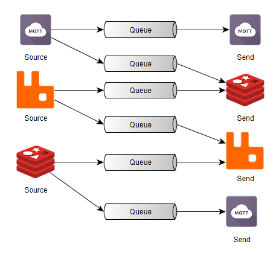
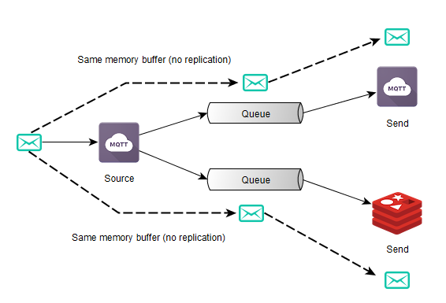

Introduction
===============================================================================
Nanopipe is a library that allows you to connect different messaging queue
systems (but not limited to) together. Nanopipe was built to avoid the 
glue code between different types of communication protocols/channels that
is very common nowadays.

The development of Nanopipe is still going on and we hope to get help
from community to improve it, to implement more sources/sends. There
are still many item on our roadmap such as a textual (or yaml, etc) 
DSL for describing the connection graphs and also a command-line utility
to use the library in order to avoid the use of the C++ library itself.

Visit the `Nanopipe Github repository <https://github.com/perone/nanopipe>`_
for sources, issues, etc.

.. _architecture:

Overall Architecture and Concepts
===============================================================================
Nanopipe has two major concepts:

**Sources**: the sources are producers of messages, they will connect to a
source of message and then they will deliver these messages to the **sends**.

**Sends**: the sends (or senders) will consume the messages delivered by
the sources to another (or even the same) messaging broker.

Note that you can have Sources and Sends that aren't strictly message queues.
You can have for instance a *send* that will call a HTTP/HTTPS REST API upon
receiving a message from a source.

This architecture is very flexible:

    - A source can have multiple sends connected, which means that all the
      sends will access the same shared memory portion;
    - Every source/send will run on its own thread, which means that
      the receiving of messages on a source will not impact performance
      on another source or send.

Internally, Nanopipe uses a producer/consumer queue with very low synchronization
requirements in order to exchange messages between sources and sends (you can also
control the size of this internal message queue). This internal message queue will
be instantiated for every source/send connection, so Nanopipe will have a different
message queue for each source/send connection, however the message delivered by
one source is shared between all its sends.

Installation
===============================================================================
This section describe how to install Nanopipe.

Requirements
-------------------------------------------------------------------------------
To use Nanopipe (and also to compile it), you'll need to install the following
requirements:

- libuv >= 1.9.1 `(official site) <https://github.com/libuv/libuv>`_
- hiredis >= 0.13.3 `(official site) <https://github.com/redis/hiredis>`_
- AMQP-CPP >= 2.6.2 `(official site) <https://github.com/CopernicaMarketingSoftware/AMQP-CPP>`_
- Mosquitto >= 1.4.10 `(official site) <https://github.com/eclipse/mosquitto>`_
- uWebSocket >= 0.10.12 `(official site) <https://github.com/uWebSockets/uWebSockets>`_

.. note:: Nanopipe uses some bleeding edge version of some of the libraries above. Some
          distributions (such as Ubuntu) has packages only for older versions of these
          libraries, so install them using source.

Building from source
-------------------------------------------------------------------------------
After installing the requirements, clone the Nanopipe repository::

    git clone https://github.com/perone/nanopipe.git

After that, create a new directory called `build` and then use `cmake` to
build it::

    cd nanopipe
    mkdir build && cd build
    cmake ..
    make -j4

To install the library in your system, execute::

    sudo make install

Using the library
===============================================================================
This section describes how to use the library and also shows some examples
using the C++ API. 

.. note:: Bindings for Python will be developed in near future. If you are
          interested in contributing, let us know.

How does it looks like ?
-------------------------------------------------------------------------------
Here is an example of an application using the Nanopipe library for you to
get a taste on how to declare the sources/sends using different systems.

.. code-block:: cpp

    #include <chrono>
    #include <nanopipe/nanopipe.hpp>

    int main(int argc, char **argv)
    {
        nanopipe_init();

        AMQPSource amqp_source1("localhost", 5672, "my-queue");
        AMQPSend amqp_send1("localhost", 5672, "exch", "anykey");
        RedisSource redis_source1("localhost", 6379, "mytopic");
        MQTTSource mqtt_source1("broker.hivemq.com", 1883, "nanopipe");
        RedisSend redis_send1("localhost", 6379, "sink");
        MQTTSend mqtt_send("broker.hivemq.com", 1883, "sinkpipe");
        StreamSend stream_send1(&std::cout);
        
        redis_source1.addSend(&redis_send1);
        redis_source1.addSend(&mqtt_send);
        redis_source1.addSend(&stream_send1);
        redis_source1.addSend(&amqp_send1);
        
        mqtt_source1.addSend(&mqtt_send);
        mqtt_source1.addSend(&stream_send1);
        mqtt_source1.addSend(&redis_send1);
        
        amqp_source1.addSend(&stream_send1);

        NanoManager manager;
        manager.addSource(&amqp_source1);
        manager.addSource(&redis_source1);
        manager.addSource(&mqtt_source1);

        manager.addSend(&stream_send1);
        manager.addSend(&redis_send1);
        manager.addSend(&amqp_send1);
        manager.addSend(&mqtt_send);
        manager.startAll();

        std::this_thread::sleep_for(std::chrono::milliseconds(10000));

        manager.stopAll();
        manager.waitAll();

        return 0;
    }

This application will execute, wait for 10 seconds and then it will stop
all source/send threads.

MQTT Source/Send
-------------------------------------------------------------------------------
The MQTT Source and Send implemented on Nanopipe is based on Mosquitto library.
Here is an use case example where we want to get messages from a MQTT broker
and then publish them on Redis. You can test this example application using
the `HiveMQ MQTT broker <http://www.hivemq.com/demos/websocket-client/>`_
where you can use your browser to connect and publish on their broker. You'll
also need a Redis server instance running.

.. literalinclude:: ../../../examples/mqtt_to_redis.cpp
   :language: cpp
   :linenos:

As you can see, the example is very simple and intuitive. We first instantiate
the source and the send and then we just connect both before starting our
manager, that will be responsible for executing the graph.

Every message published on the topic **wstopic** on the MQTT broker will be
sent to the Redis topic **wstopic**. Everything without struggling to write
glue code.

You can also use the MQTT Send to send messages to a MQTT broker instead
of using it as a source, here is an example of using it on a problem
where you want to send messages arriving on a RabbitMQ (AMQP) queue
to a MQTT broker:

.. literalinclude:: ../../../examples/amqp_to_mqtt.cpp
   :language: cpp
   :linenos:

AMQP Source/Send
-------------------------------------------------------------------------------
TODO

Redis Source/Send
-------------------------------------------------------------------------------
TODO

C++ Stream Send
-------------------------------------------------------------------------------
TODO

WebSocket Source/Send
-------------------------------------------------------------------------------
